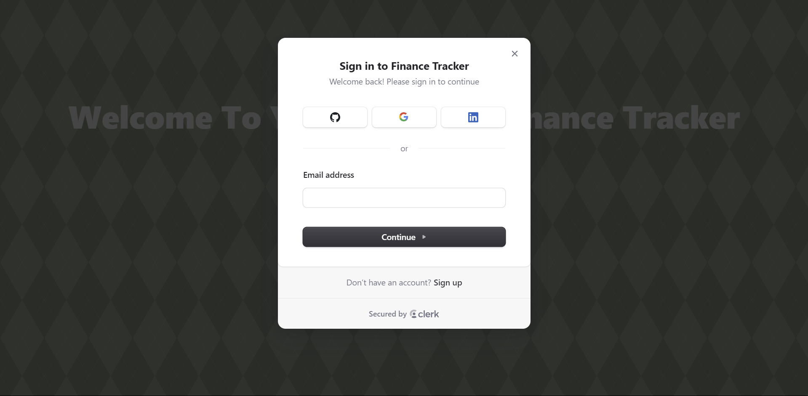
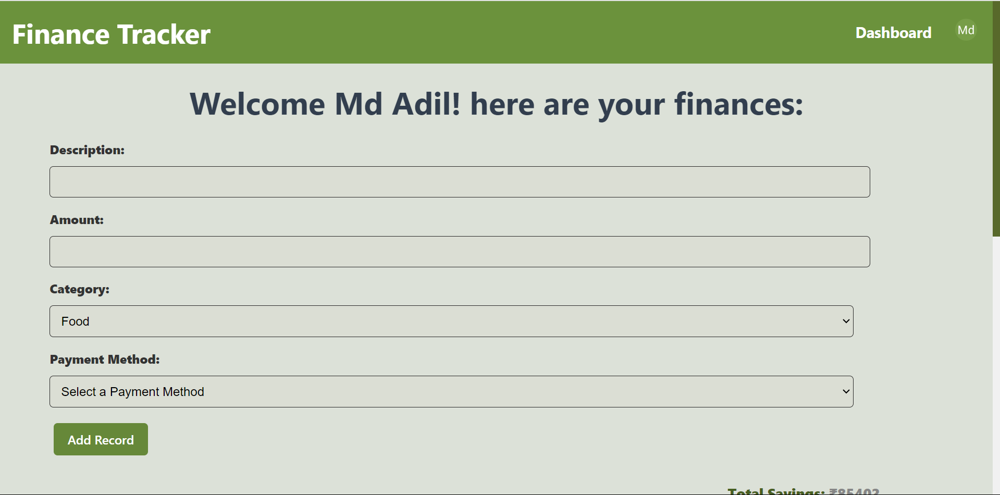

# Personal Finance Tracker

[](https://finance-tracker-tawj.onrender.com/)


## Overview

This project is a **Personal Finance Tracker** that allows users to store, organize, and manage their financial records. The application uses **MongoDB** for data storage and **Clerk** for user authentication and verification.

## Screenshots

### Login Page




### Dashboard



### Reports


## Features

- **User Authentication:** Secure user verification using Clerk.
- **RESTful API:** Backend built with Node.js and Express.js for handling CRUD operations.
- **Data Storage:** MongoDB is used for storing financial records.
- **Responsive UI:** Frontend developed with React.js and CSS for a seamless user experience.
- **Real-time Updates:** Users can view, add, edit, and delete their financial records instantly.

## Technologies Used

- **Frontend:** React.js, CSS
- **Backend:** Node.js, Express.js
- **Database:** MongoDB
- **Authentication:** Clerk
- **Deployment:** [Render.com](https://render.com)

## Installation

1. **Clone the repository:**

   ```bash
   git clone https://github.com/Aadil404/Finance_Tracker.git
   cd Finance_Tracker

2. **Install dependencies for both Frontend and Backend:**

   ```bash
    cd Backend
    npm install

    cd ../Frontend
    npm install

3. **Create a `.env` file in the Backend folder:**

   ```bash
    MONGODB_URI=your_mongo_db_uri

4. **Create a `.env.local` file in the Frontend folder:**

   ```bash
   VITE_CLERK_PUBLISHABLE_KEY=your_clerk_publishable_key

5. **Run the application:**

    - **Start the Backend server**

      ```bash
      cd Backend
      npm run dev
      ```

    - **Start the Frontend server**

      ```bash
      cd ../Frontend
      npm run dev
      ```
6. **Access the app:**

    The app will be running at `http://localhost:3000`.

